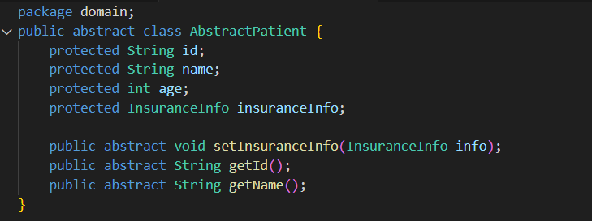
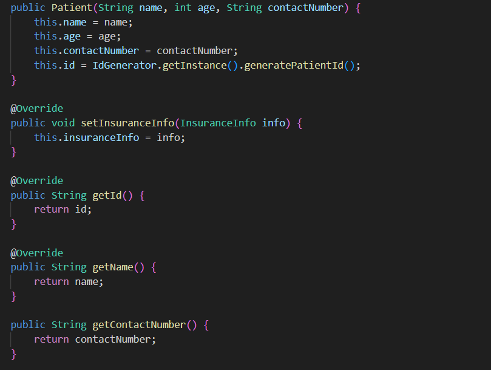
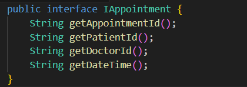
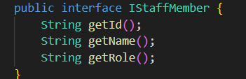
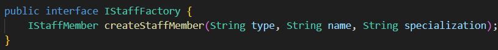
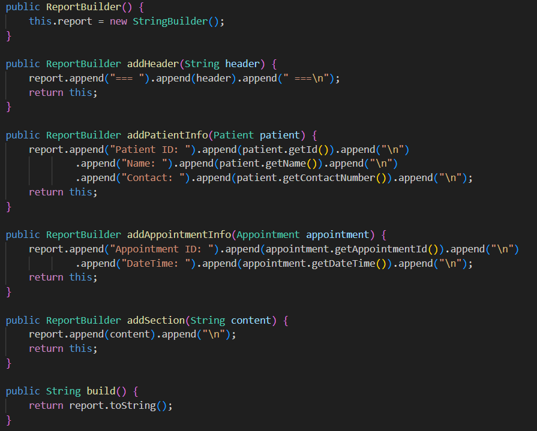
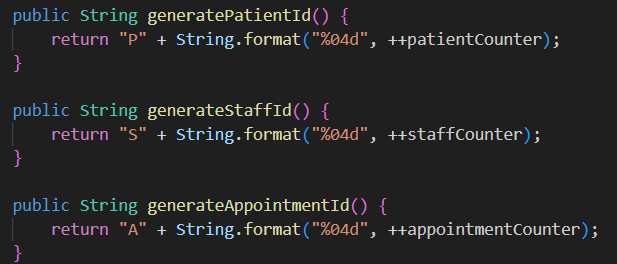
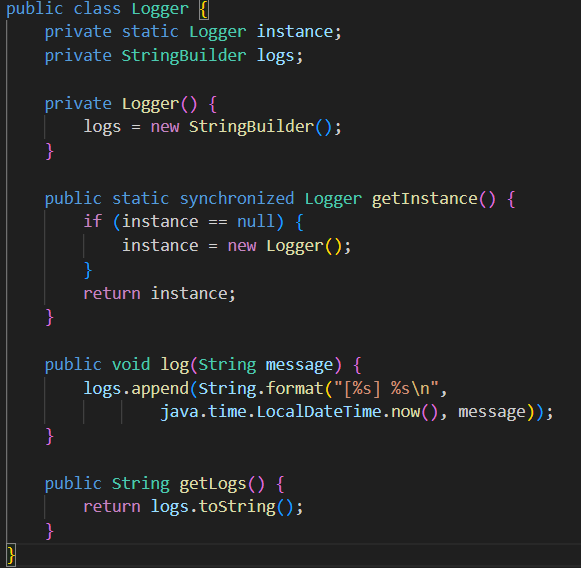
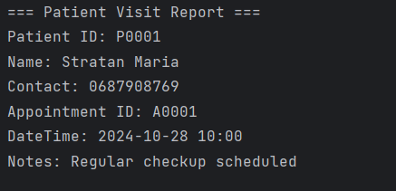
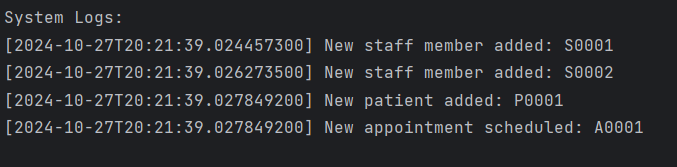

# Creational Design Patterns

----
## Author: Gorcea Alexandrina, FAF-223

----

## Objectives
* Get familiar with the Creational DPs;
* Choose a specific domain;
* Implement at least 3 CDPs for the specific domain;

## Used Design Patterns:

* Factory 
* Builder 
* Singleton

## Implementation
I made a _Hospital Management System_, which optimizes patient care by efficiently managing appointments, staff, and patient records.
It features five key directories: _domain_ for core entities, _factory_ for object creation, _builder_ for report generation, _singleton_ for centralized components, and _util_ for common operations.

The _domain_ directory contains the core business entities of the hospital system, focusing on patients, staff, and appointments. It is organized into two main subdirectories: _appointment_ and _staff_.
* __AbstractPatient__: This abstract class defines essential properties (like id, name, and age) and abstract methods for setting insurance information and retrieving patient details.

* __Patient__: This class is an implementation of _AbstractPatient_ that represents a patient with additional details like contact number, which also includes a constructor for initializing patient details and methods for accessing patient information and insurance.

* __InsuranceInfo__: Represents insurance details for a patient, including policy number, provider, and expiry date.

* __IAppointment__: An interface defining methods for appointment-related data.

* __Appointment__: Implements the IAppointment interface, managing appointment details and generating unique IDs using the IdGenerator.

* __IStaffMember__: This interface defines methods for accessing staff member information and is implemented by the _Doctor_ and _Nurse_ classes, ensuring a consistent structure for different types of staff.

* __Doctor__: Implements the _IStaffMember_ interface, providing specific details about a doctor, such as their specialization.

* __Nurse__: Implements the _IStaffMember_ interface and adds department details.

The _factory_ directory implements the Factory Pattern to create staff members and patients.
* __IStaffFactory__: Creates staff member objects, which are implemented by the StaffFactory class.

* __StaffFactory__: Implements IStaffFactory to create Doctor and Nurse instances based on type.

* __PatientFactory__: Provides a static method to create Patient objects with validation.

The _builder_ directory implements the Builder Pattern to facilitate the step-by-step creation of complex reports.

* __ReportBuilder__: Includes methods for adding headers, patient information, appointment details, and custom sections to the report, along with a build method that compiles the constructed report into a formatted string, allowing for easy generation of comprehensive reports on patient visits and appointments.

The _util_ directory contains utility classes that provide common operations and validation logic.

* __IdGenerator__: A singleton class for generating unique IDs for patients, staff, and appointments.

* __ValidationUtils__: A utility class for validating patient data to ensure correctness.

The _singleton_ directory contains classes that implement the singleton design pattern, ensuring that only one instance of each class exists throughout the application, which is particularly useful for managing shared resources such as logging and hospital system instances.
* __Logger__: Ensures that all log messages are collected in one place, facilitating easier debugging and tracking of application events.

* __HospitalSystem__: Manages the core operations of the hospital, including the registration of patients, staff members, and the scheduling of appointments, while maintaining a centralized instance for efficient resource management.
## Conclusions / Screenshots / Results

The output demonstrates the successful implementation of all three design patterns working together: the Builder Pattern creating a formatted patient report, the Factory Pattern generating unique IDs (P0001, S0001, S0002), and the Singleton Pattern maintaining a centralized logging system with timestamped entries. The output shows a complete workflow of the hospital system from staff creation through patient registration to appointment scheduling, proving that the design patterns are not just implemented but are working together cohesively in a real-world scenario.