# Structural Design Patterns

----
## Author: Gorcea Alexandrina, FAF-223

----

## Objectives
1. Study and understand the Structural Design Patterns.

2. As a continuation of the previous laboratory work, think about the functionalities that your system will need to provide to the user.

3. Implement some additional functionalities using structural design patterns.

## Used Design Patterns:

* Adapter
* Bridge
* Decorator
* Facade

## Implementation

In the following implementation, several structural design patterns are applied to enhance the flexibility and maintainability of the Hospital Management System. The goal is to simplify interactions between different subsystems, integrate with external systems, and manage notifications and dynamic appointment features.

Firstly, the __Adapter__ Pattern allows the system to interact with external healthcare systems (such as APIs or legacy systems) by converting their interfaces into one that the __Hospital Management System__ can understand and work with.
In my project, __Adapter__ provides a common interface (__IHealthSystemAdapter__) for handling patient data and appointments from different external sources.

* __IHealthSystemAdapter Interface__: Defines four key methods that each adapter must implement: imports patient data, exports patient data, fetches external appointments, and does the syncing of the appointments.

* 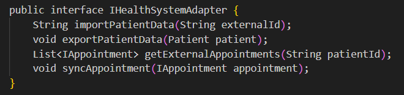

* __HealthAPIAdapter Class__: Implements the __IHealthSystemAdapter__ interface methods, using a Logger to log actions as it communicates with an external Health API. Each method provides basic functionality, such as logging actions and performing necessary operations to import, export, or sync data with the API.
  This class is designed to connect with a modern API-based health system. Modern APIs often use standard protocols, such as REST or GraphQL, which may involve additional complexity like authentication tokens, HTTP requests, and JSON handling.
* __LegacySystemAdapter Class__: Implements the interface methods to communicate with a legacy system.
  This adapter is intended for a legacy health system, which might use outdated protocols or data formats. Legacy systems might not support modern API standards and could involve unique handling, such as file-based data exchanges or direct database connections.

The __Bridge__ Pattern separates an abstraction from its implementation, allowing the __Hospital Management System__ to send notifications through different mediums (like SMS or email) while keeping the notification logic separate from the actual sending mechanism.

The __bridge__ directory in my project contains two subdirectories, __message__ and __notification__, which work together to implement the Bridge design pattern.

The __message__ directory contains classes that define messages sent to users, such as appointment notifications. It includes an abstract class, __AbstractMessage__, which holds a reference to an __INotificationSender__ (the notification interface). The specific message class, __AppointmentMessage__, extends __AbstractMessage__ and uses the __INotificationSender__ to send the message details to a recipient. This structure allows for different message types to be created without changing how the notification is sent.
* __AbstractMessage Class__: Accepts an __INotificationSender__ in its constructor, which allows each message to use any notification sender dynamically. The send method is left abstract, allowing subclasses to define the actual message content.

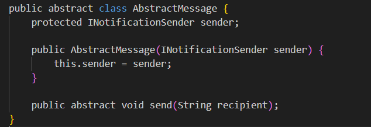

* __AppointmentMessage Class__: Extends __AbstractMessage__ and adds appointment-specific content. When the send method is called, it uses the __INotificationSender__ to deliver the message. This approach allows __AppointmentMessage__ to be used with any notification sender (e.g., SMS or email).

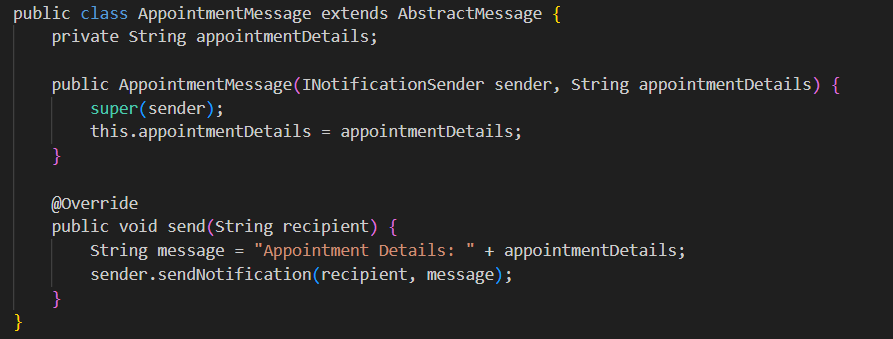

The __notification__ directory contains implementations of the __INotificationSender__ interface. These implementations (__EmailSender__ and __SMSSender__) define the details of how messages are sent, whether via email or SMS.

* __INotificationSender Interface__: Specifies a single method, __sendNotification__, which takes a recipient and a message.
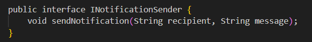

* __EmailSender__ and __SMSSender__ Classes: Implement the __INotificationSender__ interface to send notifications through specific channels.

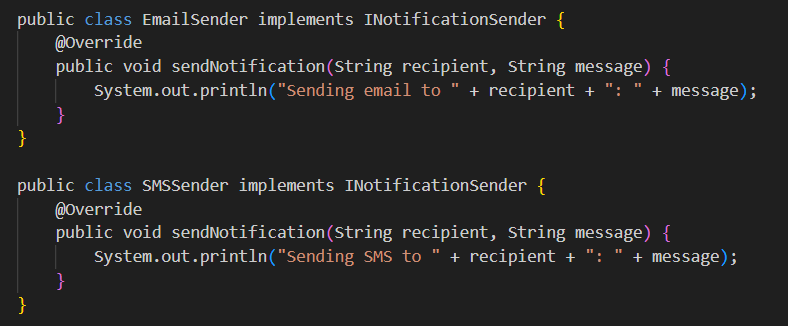

The __Decorator__ Pattern allows the behavior to be added to individual objects dynamically, without altering the behavior of other objects of the same class. It does this by "wrapping" objects in decorator classes that implement the same interface, allowing enhancements or modifications to functionality in a flexible and reusable way.

The __decorator__ directory in my project consists of two subdirectories, __appointment__ and __notification__, each implementing the __Decorator__ design pattern to add additional functionality to appointments and notifications without modifying their core implementations.

The __appointment__ directory contains decorators for the __IAppointment__ interface, (that can be seen bellow) and adds extra features to standard appointments.
 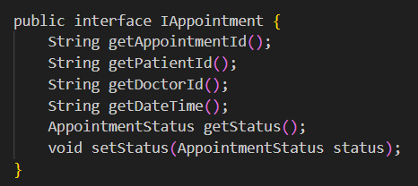

* __AppointmentDecorator Class__: Serves as the base decorator for __IAppointment__ objects, holds a reference to an __IAppointment__ instance and implements the same interface methods, delegating calls to the wrapped appointment object. This enables subclasses to add extra behaviors while still maintaining the original appointment’s properties and methods.

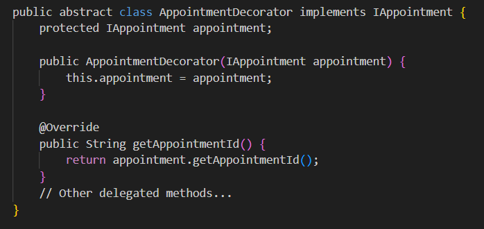

* __EmergencyDecorator Class__: Extends __AppointmentDecorator__ to add emergency-specific features to appointments. In addition to implementing __IAppointment__ methods, it provides methods like __getPriority()__ and __requiresImmediate()__, adding functionality to flag the appointment as an emergency.

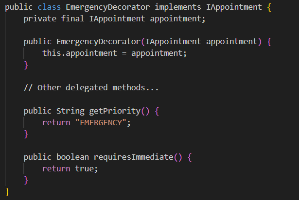

The __notification__ directory includes decorators for INotificationSender instances, enabling customization for notification delivery.

* __NotificationDecorator Class__: Wraps an INotificationSender and forwards method calls to it.

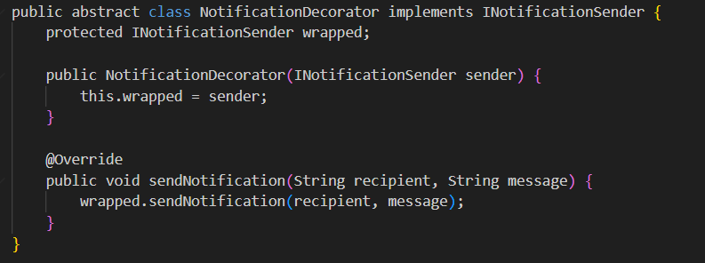

* __UrgentNotificationDecorator Class__: Extends __NotificationDecorator__ to add an __"URGENT"__ prefix to messages. It overrides __sendNotification()__ to modify the message content, flagging it as urgent.

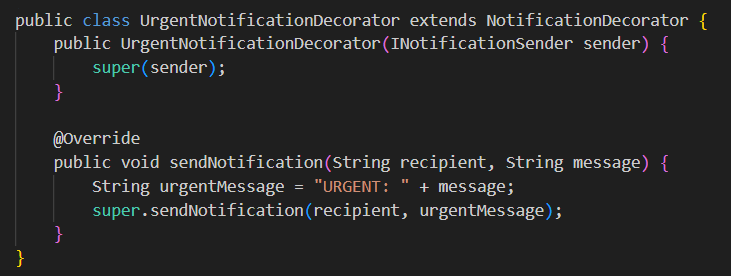

The __Facade__ Pattern simplifies complex interactions by creating a unified interface for multiple subsystems. In this healthcare management system, the facade package contains classes that centralize operations related to hospital services, medical records, and notifications, making it easier for client code to interact with these systems without knowing internal details.

* __HospitalFacade Class__: provides high-level methods to manage hospital-related operations, including staff and patient management, appointment scheduling, emergency marking, notifications, and synchronization with external systems.

Main Methods:
    
__addStaffMember__: Creates and adds a staff member to the hospital system using __StaffFactory__.

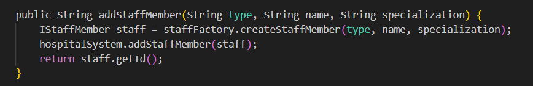

__addPatient__: Creates and adds a patient to the system with __PatientFactory__.

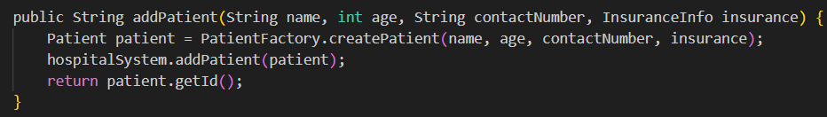

__scheduleAppointment__: Schedules an appointment by creating it and adding it to the hospital system.

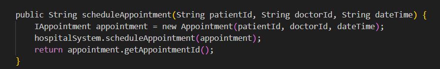

__markAppointmentAsEmergency__: Wraps an appointment in an __EmergencyDecorator__ to mark it as high-priority.

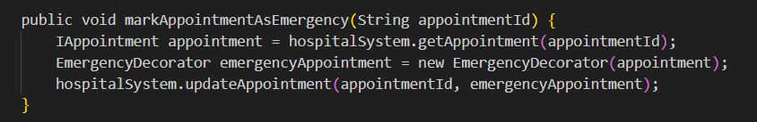

__sendAppointmentNotification__: Sends a notification about an appointment, with a choice for urgent SMS or regular email.

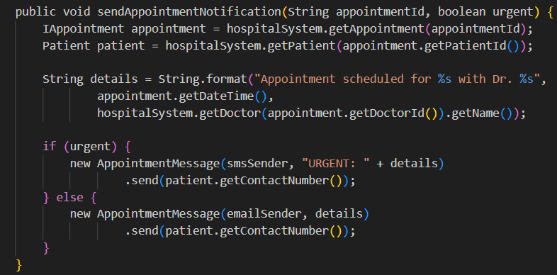

__generateReport__: Builds a report for a patient’s visit using __ReportBuilder__.

__syncWithExternalSystems__: Syncs patient data and appointments with external health systems, leveraging both __LegacySystemAdapter__ and __HealthAPIAdapter__.

* __MedicalRecordFacade Class__: Handles tasks related to patient medical records and appointment histories, streamlining the report generation process.

Main Methods:

__generatePatientReport__: Generates a comprehensive report of the patient’s information and insurance details.

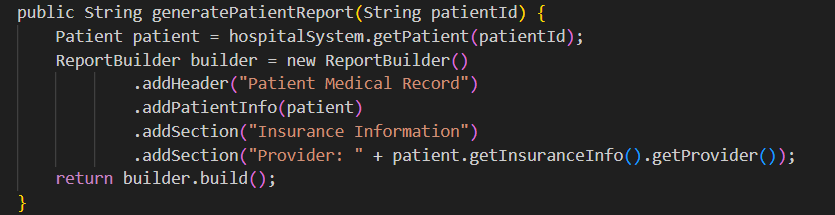

__generateAppointmentHistory__: Creates a report of a patient’s past appointments by iterating through and adding each appointment to the report using __ReportBuilder__.

* __NotificationFacade Class__: Centralizes notification operations, enabling easier and consistent message sending across different channels.

Main Methods:

__sendAppointmentReminder__: Sends a reminder about an appointment using email.

__sendUrgentNotification__: Sends an urgent notification using SMS, wrapped in an __UrgentNotificationDecorator__ to mark it as high-priority.

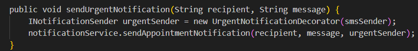

## Conclusions / Screenshots / Results

The output demonstrates a successful test of the Hospital Management System, confirming the functionality of various features:

1. Adding Staff Members: New staff members, a doctor and a nurse, are successfully added to the system, each with a unique ID.

2. Registering Patients: Two patients are registered, each with a unique patient ID.

3. Scheduling Appointments: Two appointments are scheduled for these patients, with unique appointment IDs generated.

4. Emergency Appointment Marking: The first appointment is successfully marked as an emergency, illustrating the use of the EmergencyDecorator.

5. Notification System: Notifications are sent via email and SMS, with SMS marked as "URGENT" to signify a high-priority message.

6. Report Generation: Patient records and appointment history are generated, including insurance details and appointment information.

7. External System Integration: Patient and appointment data are synchronized with legacy and API-based external systems.

8. System Logs: Comprehensive logs are generated, detailing each action taken during the test, such as adding staff, creating patients, scheduling appointments, and data export/synchronization actions.

The output demonstrates the implementation of the structural patterns in the Hospital Management System, including the __Facade__ for streamlined subsystem interactions, the __Adapter__ for integrating external health systems, the __Bridge__ for flexible notifications via email and SMS, and the __Decorator__ for adding dynamic properties like emergency status to appointments. 